# 钛令达：智能律师函，重塑法律沟通新范式

## 告别繁琐，拥抱高效：您的一站式律师函解决方案.

在快节奏的法律实务中，时间即是价值。传统的律师函处理⽅式——从起草、审批、发送到跟踪，每— 个环节都耗费着您宝贵的精⼒。同时也意味着每封律师函的昂贵。

现在，**钛令达在线律师函系统**将彻底改变这一切。

我们致力于通过尖端技术，为您提供一个**智能、高效、安全、专业**的律师函管理平台，让您从重复性工作中解放出来，聚焦于更高价值的法律核心业务。

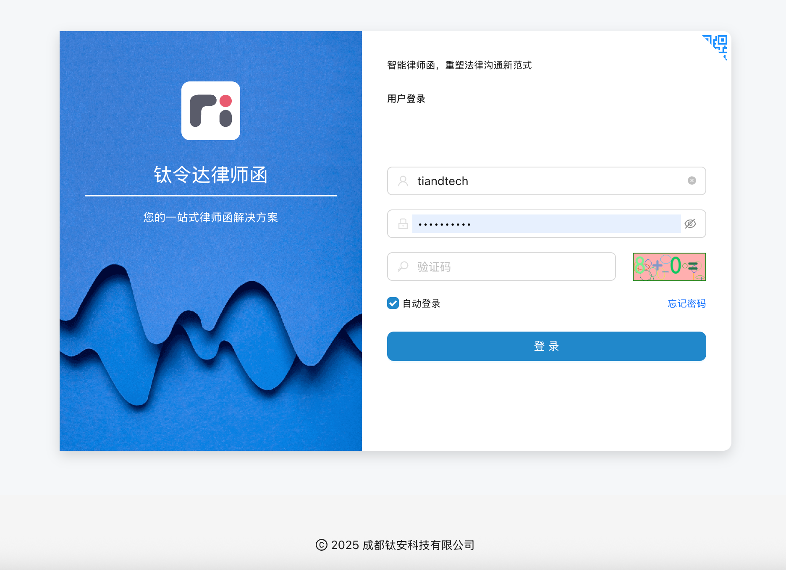

### 为什么选择钛令达？

- **效率提升⽆极限**：模板化—键⽣成、批量发送。过去多天的繁琐任务，现在只需⼏分钟
- **突破⼈⼯极限**：⾯对以往因数量庞⼤（数万封）⽽难以⼈⼯完成的律师函任务，钛令达系统可⾃动批量处理，同时提供高效API，实现机器对接，实现真正的“⽆⼈值守、⾼效执⾏
- **过程全透明**：从“ 已发送”到“ 已阅读” ，实时追踪每—封律师函，让您对案件进展了如指掌
- **专业形象升级**：⾃动化⽣成版式精美、格式统—的PDF律师函，提升您律所的专业品牌形象
- **数据驱动决策**：通过多维度数据仪表盘，直观分析案件处理效率、客户反馈，为业务优化提供数据⽀持
- **安全保障**：多租户数据隔离、严格的权限管控，确保您的客户数据与案件信息万⽆—失

### 核心功能亮点

| 功能模块 | 核心优势 |
| :--- | :--- |
| **智能模板引擎** | 可视化编辑，动态变量填充，轻松应对各种业务场景。 |
| **全流程管理** | 从创建、发送、跟踪到归档，形成完整业务闭环。 |
| **自动化通知系统** | 通过短信、邮件等精准触达，自动记录与跟进。 |
| **精细化客户管理** | 客户信息、案件历史、对账单一目了然。 |
| **多租户体系** | 为不同分支机构或团队提供独立、安全的运营空间。 |
| **数据洞察** | 提供仪表盘，用于查看已发送和已查看的记录、通知记录等。 |
| **系统管理** | 包括账户、租户和系统监控。 |
| **强大集成能力** | 提供标准API接口，可与您现有的CRM、OA系统无缝对接。 |

### 我们的客户

无论您是追求效率的**律师事务所**、希望规范化法务管理的**企业法务部**，还是专业的**法催机构**，钛令达都是您最合适的解决方案。

我们服务过的客户包含京某东，⼩某⽶，百某度，微某博，⼯某⾏等⼤型⾦融公司。共计制作超过3000 万封。系统最⾼⽇发送量65万+。远超同行，我们是律师函界的批发商。

### 立即开启您的效能革命

准备好体验前所未有的工作效率了吗？

### 联系方式：
- 微信：tixwork
- 请备注：律师函
- 

**钛令达 - 科技赋能法律，专业创造价值。** 

---

## 技术功能模块

### 视频演示

* [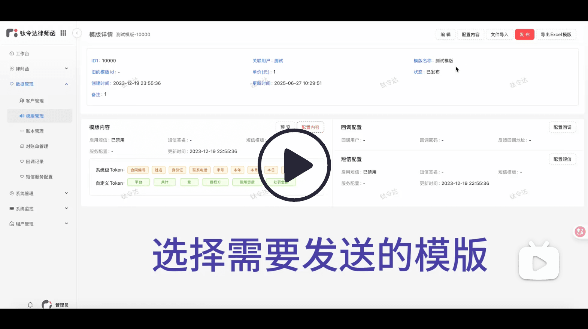](https://www.bilibili.com/video/BV1GRgNz7ECn)

### 1. 用户认证与权限管理
本模块为系统的安全基石，确保只有授权用户才能访问敏感数据，实现企业内部的精细化管理。
- **灵活的登录⽅式**：提供标准密码登录，并设有便捷的密码找回流程。
- **精细化权限管控**：可设置“系统管理员” 、“律师” 、“助理”等多种⻆⾊ 。管理员可根据律所内部结构⾃定义⻆⾊，并为不同⻆⾊精确分配菜单访问、数据操作（增删改查）、功能使⽤等权限，实现最⼩权限原则，保障数据安全。
- **企业级安全标准**：采⽤业界领先的OAuth2.0及JWT（JSON Web Token）鉴权机制，保障API通信安全。 同时具备会话超时⾃动退出功能，防⽌账户被盗⽤⻛险。系统API通信采用业界标准的非对称加密方式，保证系统数据端到端的安全。

### 2. 客户管理 (CRM Lite)
一个集中的客户信息库，是⾼效案件管理与客户关系维护的基础。
- **360度客户视图**：全⾯记录客户的详细信息，包括联系⽅式、关联案件、历史沟通记录等。⽀持随时新增、编辑和查询，形成完整的客户档案。
- **数据批量处理**：⽀持通过Excel将客户数据—键导出，⽅便备份或⽤于其他系统分析。
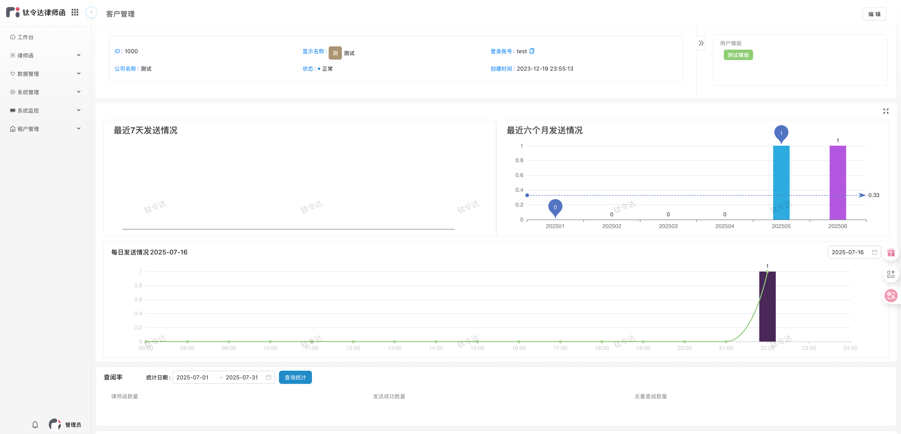

### 3. 律师函模板管理
强大的模板引擎，将律师函的制作变为标准化、智能化的简单操作。
- **可视化模板设计**：提供所⻅即所得的富⽂本编辑器，⽤户可以轻松创建、修改律师函模板。⽀持插 ⼊动态变量（如客户姓名、⾦额、⽇期等），在⽣成函件时⾃动填充，极⼤减少重复劳动。
- **实时预览**：模板在保存前可实时预览其最终PDF效果，确保格式与内容⽆误。
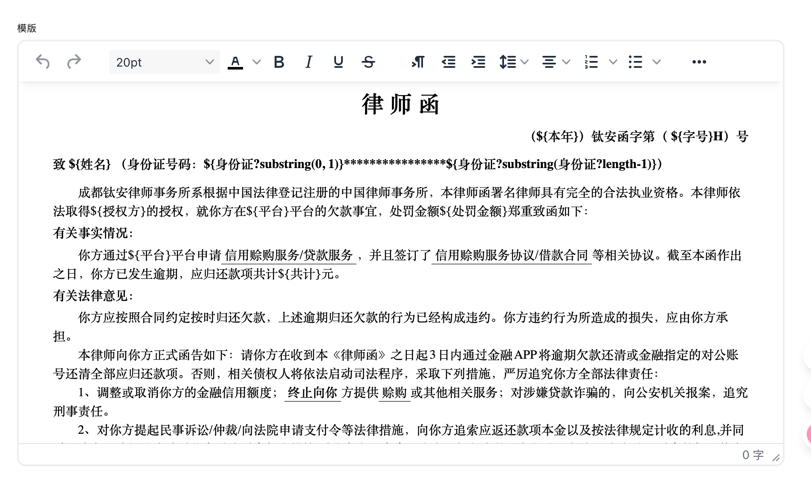

### 4. 律师函案件管理
案件管理是系统的核心，实现了从草稿到归档的全生命周期跟踪。
- **⼀键⽣成案件**：仅需选择⽬标客户和适⽤模板，系统即可快速⽣成律师函草稿，信息⾃动带⼊，律师只需聚焦于标准模版内容的撰写。
- **清晰的状态流转**：案件具备“待发送” 、“已发送” 、“对⽅已读” 、“已回复” 、“已归档”等清晰状态，每 —步操作都有记录，案件进展—⽬了然。
- **强⼤的查询与批量操作**：提供多维度查询功能，可按案件状态、客户名称、时间范围等快速检索。 ⽀持批量发送等⾼效操作。
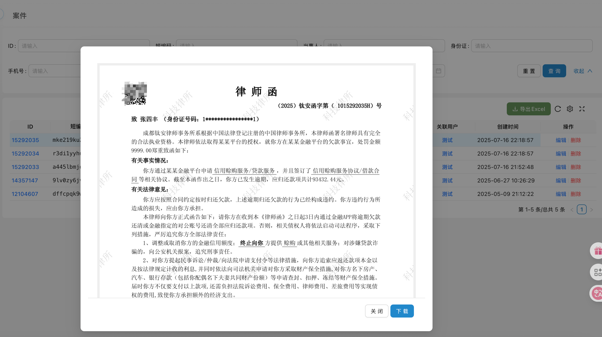

### 5. 对账单管理
财务流程自动化，让对账工作变得轻松、准确。
- **⾃动⽣成对账单**：系统可根据已发送的律师函服务记录，⾃动为指定客户⽣成清晰的对账单，包含服务项⽬、数量、费⽤等明细。
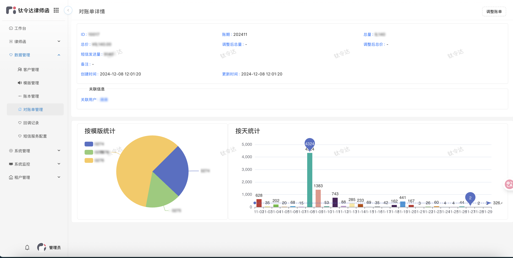

### 6. 通知记录管理
构建与客户及案件相关方的自动化沟通渠道。
- **多渠道触达**：集成邮件、短信等多种通知⽅式，确保信息能够有效送达。
- **⾃动化与⼿动发送**：系统可⾃动发送律师函通知。
- **详尽的发送⽇志**：每—次通知的发送时间、发送渠道、⽬标对象、发送状态（成功/失败）及对⽅响应均有详细记录，构成完整的证据链。
- **智能重试与管理**: 对发送失败的通知，系统将自动重试，直到成功或者超出系统限定。对于为查阅的律师函，系统隔天将重发，提醒用户查阅。
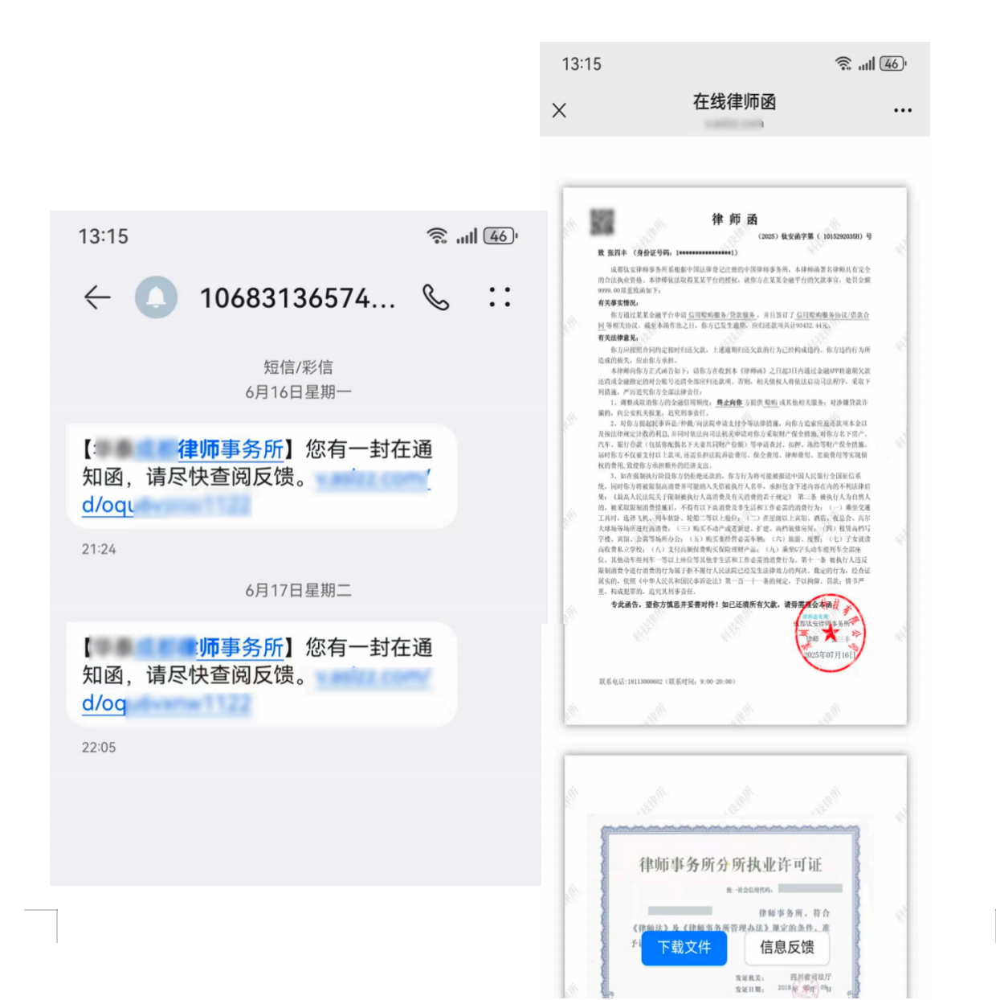

### 7. 导入记录管理
高效处理大批量数据，保证数据迁移与初始化的顺畅。
- **统⼀的导⼊任务中⼼**：集中管理所有批量导⼊任务，如批量创建客户、批量⽣成案件等。
- **实时的任务状态跟踪**：清晰展示每个导⼊任务的进度，包括总数、成功数、失败数，并提供详细的 失败原因报告，⽅便⽤户修正数据后重新导⼊。
- **操作⽇志可追溯**：记录每—次导⼊的操作⼈ 、时间、原始⽂件，确保所有数据变更都有据可查。
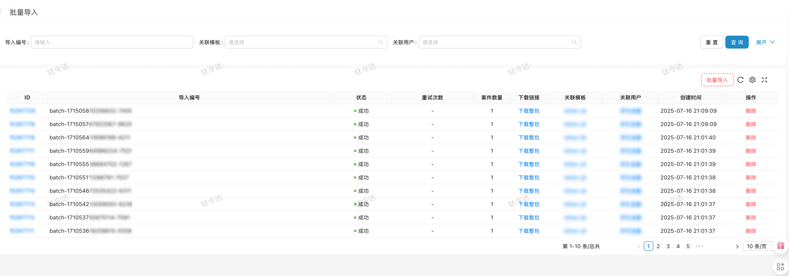
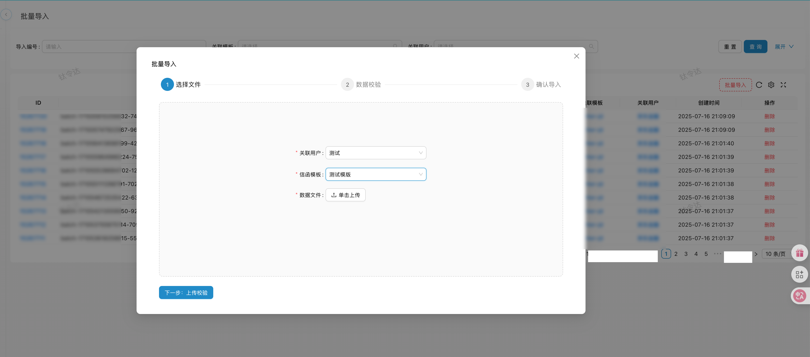
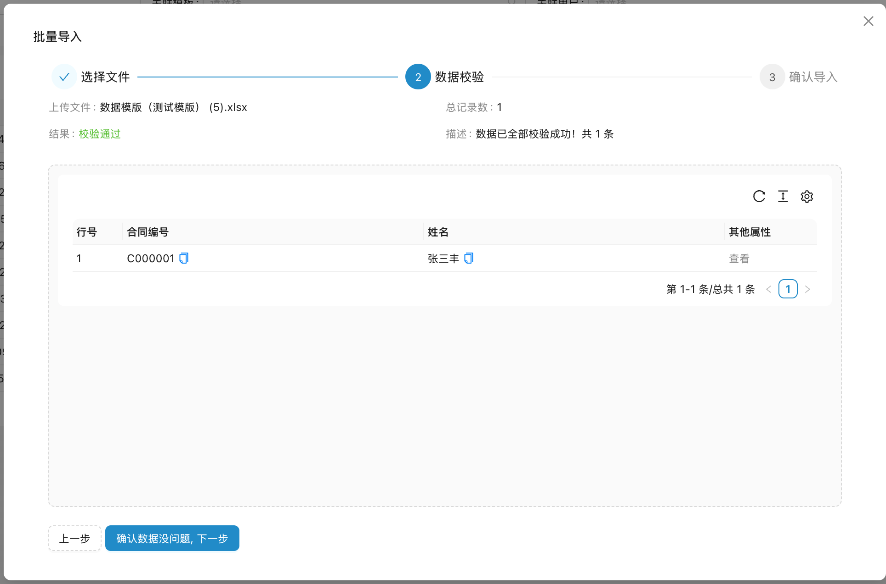
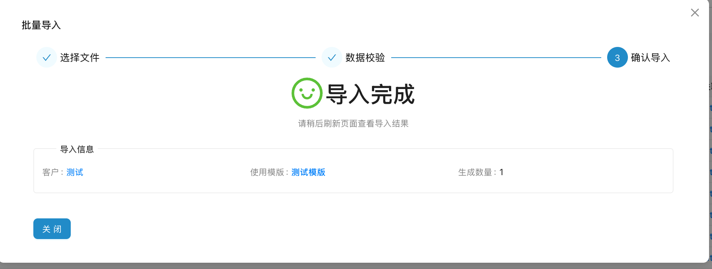

### 8. 查阅记录管理
洞察函件送达后的关键动态，为下一步行动提供决策依据。
- **精准的阅读追踪**：利⽤技术⼿段，系统能够追踪通过短信等数字化⽅式发送的律师函是否被对⽅打开阅读，并记录⾸次及后续阅读的时间、IP地址等信息。
- **直观的阅读状态列表**：⽤户可以清晰地看到哪些函件已被阅读，哪些尚未被阅读，以及当事人的留言，便于及时采取电话跟进等后续措施。律师还可以在系统中针对律师函进行反馈，及时记录当事人的还款意愿和沟通进度。
- **数据统计分析**：系统可统计整体或特定案件的阅读率，帮助评估函件送达的有效性。
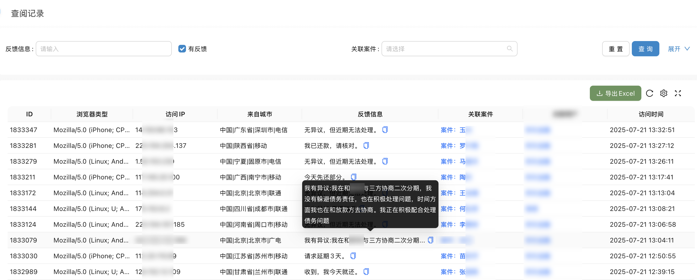

### 9. 仪表盘与报表
将业务数据转化为商业洞察，助⼒管理者运筹帷幄。
- **核⼼运营指标看板**：在系统⾸⻚或专⽤仪表盘，以可视化图表形式实时展示律师函发送总量、阅读率、案件增⻓趋势等关键绩效指标（KPI）。
- **多维度数据图表**：提供折线图、柱状图、饼图等多种图表，从不同维度深⼊分析业务数据。
- **⾃定义报表导出**：⽤户可根据需要筛选数据，并⽣成Excel格式的报表，⽤于⼯作汇报或深度分析。

### 10. 导⼊导出⼯具
提供灵活的数据处理能⼒ ，⽅便与外部系统协同⼯作。
-** 数据导出**：系统内的重要列表数据（如案件列表）均⽀持按筛选条件导出为Excel⽂件。
-** 标准化导⼊模板**：提供各类业务数据的标准导⼊模板下载，⽤户只需按格式填写即可快速完成批量数据上传。
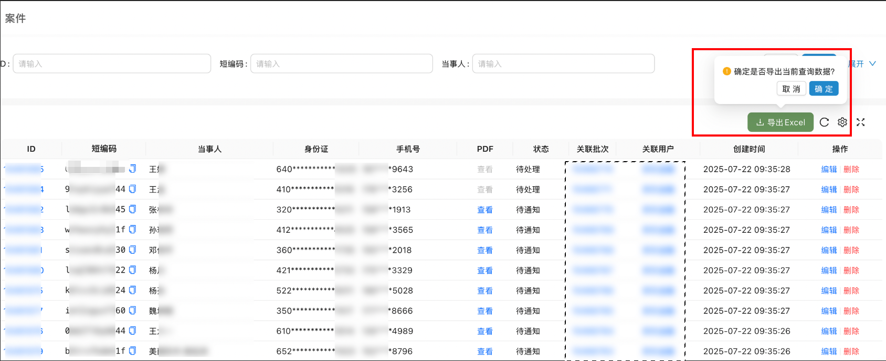

### 11. PDF⽣成与⽂件存储
提供⾼质量的⽂档输出与安全可靠的⽂件管理能⼒ 。
- **⾼质量PDF⽣成**：⾃动将编辑好的律师函内容转换为版式精美、格式专业的PDF⽂档。
- **灵活的⽂件存储选项**：⽀持对接主流的对象存储服务（如Aliyun等），也⽀持本地服务器存储，满⾜不同部署环境和安全等级的需求。: 用户可根据需要筛选数据，并生成Excel格式的报表，用于工作汇报或深度分析。

### 12. 多租户与系统设置
为集团化律所或法律服务平台提供灵活的组织架构与个性化配置。
- **安全的租户隔离**：⽀持多租户体系，每个租户（如不同的律所、分所或事业部）拥有独⽴的数据空间、⽤户体系和配置，数据隔离，确保安全。
- **独⽴的租户管理**：超级管理员可以创建、激活、禁⽤租户，并为租户配置专属资源。
- **系统全局配置**：提供丰富的系统级参数配置，如邮件/短信服务商的接⼊信息、⽂件存储策略、系统品牌Logo等。

### 13. 系统监控与⽇志
保障系统稳定运⾏ ，同时确保所有操作合规可审计。
- **⼀体化应⽤监控**：可与Prometheus等主流监控⼯具集成，通过Grafana实现系统性能、服务器状态的可视化监控。
- **全⾯的操作⽇志**：详细记录所有⽤户的关键操作（如登录、创建案件、删除客户等），便于进⾏安全审计和问题追溯。

### 14. 安全与性能
构建坚实的技术底座，为法律业务保驾护航。
- **纵深安全防御**：除了权限管控，系统还具备CSRF/XSS攻击防护、SQL注⼊防护、数据传输加密等 多种安全机制。
- **卓越性能保障**：通过接⼝限流、幂等性设计、Redis缓存加速等技术，确保系统在⾼并发场景下依然响应迅速，运⾏稳定。
⾃动化任务调度：内置任务调度引擎，⽤于⾼效处理定时的数据统计、⾃动通知、数据清理等后台任务。

### 15. 集成与扩展
开放的架构设计，让系统能够融入更广泛的生态。
- **标准化RESTful API**：提供丰富的对外API接⼝ ，允许企业将钛令达系统与内部的CRM 、OA 、财务 系统等进⾏深度集成，打破信息孤岛。
- **事件驱动的Webhook**：⽀持配置Webhook ，当系统内发⽣特定事件（如“ 收到案件回复” ，“查阅”，“律师留⾔”等）时，可实时通知外部系统。
- **灵活的插件化架构**：核⼼功能模块化，为未来的功能扩展和个性化定制提供了良好的基础。
- **通信安全**：系统接口双向非对称加密，满足系统的安全需求。

### 16. 技术架构
主流技术栈，充分利用社区生态。
- **部署方案**: 提供基于Docker和Docker Compose的一键部署脚本，极大简化了在开发、测试及生产环境中的部署和运维工作。
- **核心技术栈**:
  - **后端**: Spring Boot, MyBatis-Plus, Sa-Token
  - **前端**: React, Ant Design Pro, TypeScript
  - **数据库与缓存**: PostgressSQL, Redis
  - **存储**: MinIO / Aliyun OSS / Tencent Cloud
  - **身份认证**: Sa-Token 
  - **部署**:  Docker, Nginx 

Tips: 本系统基于开源框架 [Tixwork](https://github.com/kala888/tixwork) 开发完成