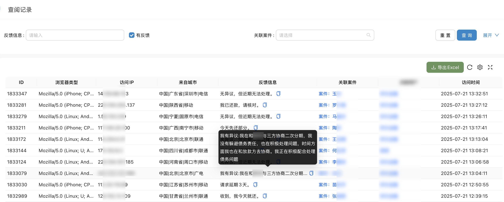

## 技术功能模块

### 视频演示

* 

### 1. 用户认证与权限管理
本模块为系统的安全基石，确保只有授权用户才能访问敏感数据，实现企业内部的精细化管理。
- **灵活的登录方式**: 支持使用常用邮箱或手机号进行注册，提供验证码快速登录及标准密码登录，并设有便捷的密码找回流程，兼顾安全性与用户体验。
- **精细化权限管控**: 内置“系统管理员”、“律师”、“助理”等多种预设角色。管理员可根据律所内部结构自定义角色，并为不同角色精确分配菜单访问、数据操作（增删改查）、功能使用等权限，实现最小权限原则，保障数据安全。
- **企业级安全标准**: 采用业界领先的OAuth2.0及JWT（JSON Web Token）鉴权机制，保障API通信安全。同时具备会话超时自动退出功能，防止账户被盗用风险。

### 2. 客户管理 (CRM Lite)
一个集中的客户信息库，是高效案件管理与客户关系维护的基础。
- **360度客户视图**: 全面记录客户的详细信息，包括联系方式、关联案件、历史沟通记录、对账信息等。支持随时新增、编辑和查询，形成完整的客户档案。
- **智能分组与筛选**: 用户可根据案件类型、客户来源、重要等级等维度为客户打上自定义标签，或进行分组管理。在处理大量客户时，能够快速筛选定位，提升工作效率。
- **数据批量处理**: 支持通过Excel/CSV模板批量导入客户资料，免去手动录入的繁琐。同时，也可将客户数据一键导出，方便备份或用于其他系统分析。

### 3. 律师函模板管理
强大的模板引擎，将律师函的制作变为标准化、智能化的简单操作。
- **可视化模板设计**: 提供所见即所得的富文本编辑器，用户可以轻松创建、修改律师函模板。支持插入动态变量（如客户姓名、金额、日期等），在生成函件时自动填充，极大减少重复劳动。
- **实时预览与版本控制**: 模板在保存前可实时预览其最终PDF效果，确保格式与内容无误。同时支持历史版本查看，方便追溯与管理。

### 4. 律师函案件管理
案件管理是系统的核心，实现了从草稿到归档的全生命周期跟踪。
- **一键生成案件**: 仅需选择目标客户和适用模板，系统即可快速生成律师函草稿，信息自动带入，律师只需聚焦于个性化内容的撰写。
- **清晰的状态流转**: 案件具备“待发送”、“已发送”、“对方已读”、“已回复”、“已归档”等清晰状态，每一步操作都有记录，案件进展一目了然。
- **强大的查询与批量操作**: 提供多维度查询功能，可按案件状态、客户名称、时间范围等快速检索。支持批量发送、批量更新状态、批量归档等高效操作。

### 5. 对账单管理
财务流程自动化，让对账工作变得轻松、准确。
- **自动生成对账单**: 系统可根据已发送的律师函服务记录，自动为指定客户生成清晰的对账单，包含服务项目、数量、费用等明细。
- **自动对账单模板**: 系统定时自动生成的对账单，方便及时和客户对账收款。

### 6. 通知记录管理
构建与客户及案件相关方的自动化沟通渠道。
- **多渠道触达**: 集成邮件、短信等多种通知方式，确保信息能够有效送达。
- **自动化与手动发送**: 系统可自动发送律师函、对账单、缴费提醒等通知，也可由用户手动触发。
- **详尽的发送日志**:每一次通知的发送时间、发送渠道、目标对象、发送状态（成功/失败）及对方响应（如邮件打开）均有详细记录，构成完整的证据链。
- **智能重试与管理**: 对发送失败的通知，提供一键重发功能，简化了后续操作。

### 7. 导入记录管理
高效处理大批量数据，保证数据迁移与初始化的顺畅。
- **统一的导入任务中心**: 集中管理所有批量导入任务，如批量创建客户、批量生成案件等。
- **实时的任务状态跟踪**: 清晰展示每个导入任务的进度，包括总数、成功数、失败数，并提供详细的失败原因报告，方便用户修正数据后重新导入。
- **操作日志可追溯**: 记录每一次导入的操作人、时间、原始文件，确保所有数据变更都有据可查。

### 8. 阅读记录管理
洞察函件送达后的关键动态，为下一步行动提供决策依据。
- **精准的阅读追踪**: 利用技术手段，系统能够追踪通过电子邮件等数字化方式发送的律师函是否被对方打开阅读，并记录首次及后续阅读的时间、IP地址等信息。
- **直观的阅读状态列表**: 用户可以清晰地看到哪些函件已被阅读，哪些尚未被阅读，便于及时采取电话跟进等后续措施。
- **数据统计分析**: 系统可统计整体或特定案件的阅读率，帮助评估函件送达的有效性。

### 9. PDF生成与文件存储
提供高质量的文档输出与安全可靠的文件管理能力。
- **高质量PDF生成**: 自动将编辑好的律师函内容转换为版式精美、格式专业的PDF文档。
- **灵活的文件存储选项**: 支持对接主流的对象存储服务（如Aliyun等），也支持本地服务器存储，满足不同部署环境和安全等级的需求。
- **便捷的文件管理**: 提供统一的文件库，用户可以方便地预览、下载和管理所有与案件相关的文档。

### 10. 多租户与系统设置
为集团化律所或法律服务平台提供灵活的组织架构与个性化配置。
- **安全的租户隔离**: 支持多租户体系，每个租户（如不同的律所、分所或事业部）拥有独立的数据空间、用户体系和配置，数据之间物理隔离，确保安全。
- **独立的租户管理**: 超级管理员可以创建、激活、禁用租户，并为租户配置专属资源。
- **系统全局配置**: 提供丰富的系统级参数配置，如邮件/短信服务商的接入信息、文件存储策略、系统品牌Logo等。

### 11. 仪表盘与报表
将业务数据转化为商业洞察，助力管理者运筹帷幄。
- **核心运营指标看板**: 在系统首页或专用仪表盘，以可视化图表形式实时展示律师函发送总量、阅读率、案件增长趋势等关键绩效指标（KPI）。
- **多维度数据图表**: 提供折线图、柱状图、饼图等多种图表，从不同维度深入分析业务数据。
- **自定义报表导出**: 用户可根据需要筛选数据，并生成Excel格式的报表，用于工作汇报或深度分析。

### 12. 系统监控与日志
保障系统稳定运行，同时确保所有操作合规可审计。
- **一体化应用监控**: 可与Prometheus等主流监控工具集成，通过Grafana实现系统性能、服务器状态的可视化监控。
- **全面的操作日志**: 详细记录所有用户的关键操作（如登录、创建案件、删除客户等），便于进行安全审计和问题追溯。

### 13. 导入导出工具
提供灵活的数据处理能力，方便与外部系统协同工作。
- **通用数据导出**: 系统内的各类列表数据（如案件列表）均支持按筛选条件导出为Excel文件。
- **标准化导入模板**: 提供各类业务数据的标准导入模板下载，用户只需按格式填写即可快速完成批量数据上传。

### 14. 安全与性能
构建坚实的技术底座，为法律业务保驾护航。
- **纵深安全防御**: 除了权限管控，系统还具备CSRF/XSS攻击防护、SQL注入防护、数据传输加密等多种安全机制。
- **卓越性能保障**: 通过接口限流、幂等性设计、Redis缓存加速等技术，确保系统在高并发场景下依然响应迅速，运行稳定。
- **自动化任务调度**: 内置任务调度引擎，用于高效处理定时的数据统计、自动通知、数据清理等后台任务。

### 15. 集成与扩展
开放的架构设计，让系统能够融入更广泛的生态。
- **标准化RESTful API**: 提供丰富的对外API接口，允许企业将钛令达系统与内部的CRM、OA、财务系统等进行深度集成，打破信息孤岛。
- **事件驱动的Webhook**: 支持配置Webhook，当系统内发生特定事件（如“收到案件回复”，“查阅”，“律师留言”等）时，可实时通知外部系统。
- **灵活的插件化架构**: 核心功能模块化，为未来的功能扩展和个性化定制提供了良好的基础。

### 16. 技术架构
主流技术栈，充分利用社区生态。
- **部署方案**: 提供基于Docker和Docker Compose的一键部署脚本，极大简化了在开发、测试及生产环境中的部署和运维工作。
- **核心技术栈**:
  - **后端**: Spring Boot, MyBatis-Plus, Sa-Token
  - **前端**: React, Ant Design Pro, TypeScript
  - **数据库与缓存**: PostgressSQL, Redis
  - **存储**: MinIO / Aliyun OSS / Tencent Cloud
  - **身份认证**: Sa-Token 
  - **部署**:  Docker, Nginx 

tips: 本系统基于开源框架 [Tixwork](https://github.com/kala888/tixwork) 开发

# 部分系统截图

### 客户信息

### 对账单

### 批次导入

### 查阅记录

### 移动端查阅与通知

